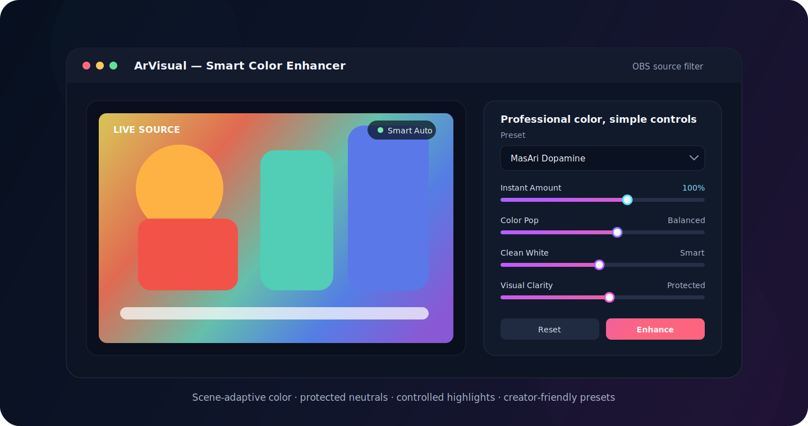

<div align="center">
  

# ArVisual Smart Color Enhancer for OBS

**Scene-adaptive color enhancement for creators who want a cleaner, brighter and more vivid OBS image without learning professional color grading.**

[Website](https://masarray.github.io/arvisual-obs/) · [Download](https://github.com/masarray/arvisual-obs/releases/latest) · [Quick start](docs/QUICK_START.md) · [Report a bug](https://github.com/masarray/arvisual-obs/issues/new/choose)

[](https://github.com/masarray/arvisual-obs/releases/latest)
[](https://github.com/masarray/arvisual-obs/actions/workflows/release.yml)
[](LICENSE)
[](https://obsproject.com/)

</div>



## Make every source presentation-ready

ArVisual is a native OBS Studio video filter built for webcams, product reviews, tutorials, games, display capture and recorded video. Its Smart Auto engine reads the scene, applies bounded corrections and protects important visual regions instead of applying the same saturation and brightness boost to every frame.

The result is designed to feel polished and vivid while keeping whites neutral, highlights controlled and skin tones believable.

## Why creators use ArVisual

- **Smart Auto scene analysis** adjusts exposure pressure, color dose, highlight protection and shadow handling to the current frame.
- **Instant Amount** controls the complete look from one master control.
- **Color Pop** strengthens useful color separation without treating neutral pixels as color.
- **Clean White** removes unwanted cast from neutral surfaces while restraining excessive white or gray lift.
- **Visual Clarity** adds luma detail with anti-halo and highlight-aware protection.
- **Skin Beauty and Healthy Tone** improve presentation while using tighter skin-specific limits.
- **3D Depth Pop and Toy Gloss** add controlled object separation and highlight finish.
- **Performance tiers** let users balance visual quality and rendering cost.
- **Preset-first workflow** provides practical starting points for products, beauty, gaming, classrooms and general streaming.

## Presets

| Preset | Designed for |
|---|---|
| **MasAri Dopamine** | Balanced, high-energy all-round enhancement |
| **Kids Toy Pop** | Toys, children’s content and colorful product scenes |
| **Cars Candy Color** | Strong candy-like automotive and animation colors |
| **Product Clean Pop** | Unboxing, audio gear, electronics and review videos |
| **Beauty Bright** | Webcam, presenter and talking-head sources |
| **Gaming Vivid** | Colorful games and screen capture |
| **Natural Safe** | Meetings, education and conservative enhancement |
| **Cinematic Candy** | Softer contrast with a polished color finish |

## Install

### Windows x64 — recommended

1. Download `ArVisual-OBS-Setup-vX.X.X-windows-x64.exe` from the [latest release](https://github.com/masarray/arvisual-obs/releases/latest).
2. Close OBS Studio.
3. Run the installer. It detects the OBS Studio installation folder automatically.
4. Open OBS Studio and add **ArVisual - Smart Color Enhancer** from the source filter list.

The installer understands that the OBS directory already exists. It does not show a generic “folder exists” warning. A warning appears only when OBS cannot be detected, and installation is blocked until a valid OBS root containing `bin\64bit\obs64.exe` is selected.

### Manual Windows package

Extract `arvisual-obs-vX.X.X-windows-x64.zip` into the OBS Studio root so the final files are:

```text
C:\Program Files\obs-studio\obs-plugins\64bit\arvisual.dll
C:\Program Files\obs-studio\data\obs-plugins\arvisual\effects\arvisual.effect
C:\Program Files\obs-studio\data\obs-plugins\arvisual\locale\en-US.ini
```

### macOS and Linux

The release workflow also targets a macOS universal package and Debian/Ubuntu-style Linux packages. Package names and manual paths are documented in [Quick Start](docs/QUICK_START.md).

## Add the filter in OBS

1. Restart OBS Studio after installation.
2. Right-click a camera, display capture, game capture, image or video source.
3. Select **Filters**.
4. Under **Effect Filters**, click **+**.
5. Select **ArVisual - Smart Color Enhancer**.
6. Start with **MasAri Dopamine** or **Product Clean Pop**, then adjust **Instant Amount**.

## Engine design

ArVisual v0.5.9 uses a native OBS render path with a small scene-analysis stage and a GPU effect stage. The engine includes active-picture statistics, bounded scene adaptation, luminance-preserving gamut mapping, per-family saturation limits, neutral protection, skin-specific constraints, anti-halo clarity and ABI validation between the plugin and shader.

The project is currently built against OBS Studio `31.1.1` through `buildspec.json`.

## Build from source

### Windows one-click build

Requirements:

- Windows 10 or 11 x64
- Visual Studio 2022 or newer with **Desktop development with C++**
- CMake and Git
- Internet access for the first dependency bootstrap

Run:

```bat
build-local-windows.bat
```

The script overlays ArVisual into the OBS plugin template, resolves the pinned OBS dependencies, builds the native plugin and creates a manual ZIP in `release/`.

For Visual Studio 2026:

```bat
build-local-windows-vs2026.bat
```

### Release automation

Creating a semantic version tag starts the cross-platform release workflow:

```powershell
git tag v0.5.9
git push origin v0.5.9
```

The workflow builds the Windows installer and ZIP, macOS package and manual ZIP, Linux DEB and manual archive, then publishes them as separate GitHub Release assets.

## Documentation

- [Quick start](docs/QUICK_START.md)
- [Troubleshooting](docs/TROUBLESHOOTING.md)
- [Contributing](CONTRIBUTING.md)
- [Security policy](SECURITY.md)
- [Changelog](CHANGELOG.md)

## Project status

ArVisual is an actively developed public project. Real-world validation should continue to focus on OBS loading reliability, preset behavior, skin and neutral stability, no flicker or black output, and comfortable 1080p60 performance across representative GPUs.

## License

Copyright © Mas Ari. Distributed under the [GNU General Public License v2.0 or later](LICENSE).

OBS Studio is a trademark of its respective owner. ArVisual is an independent community project and is not affiliated with or endorsed by OBS Project.
